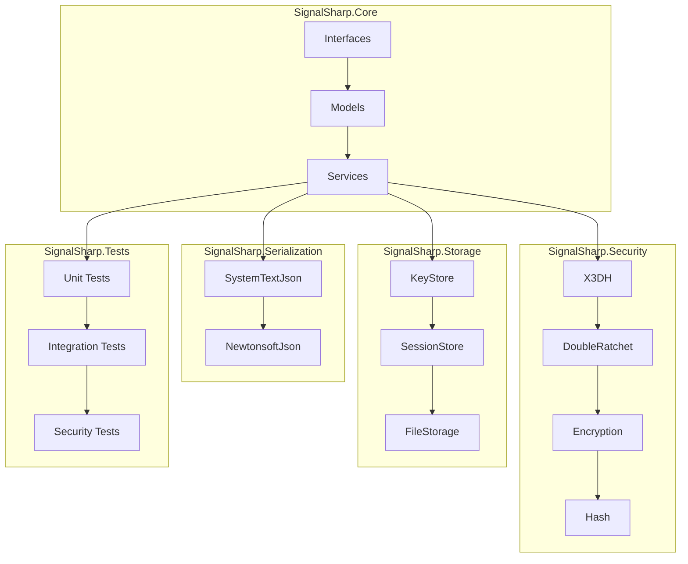
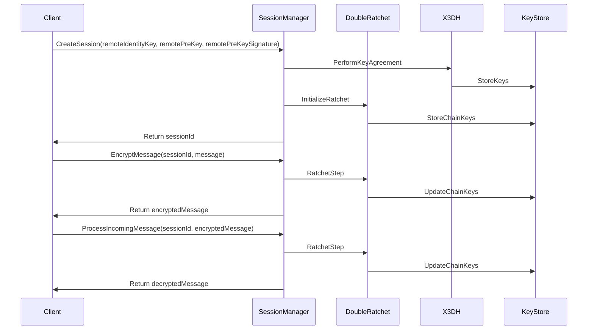
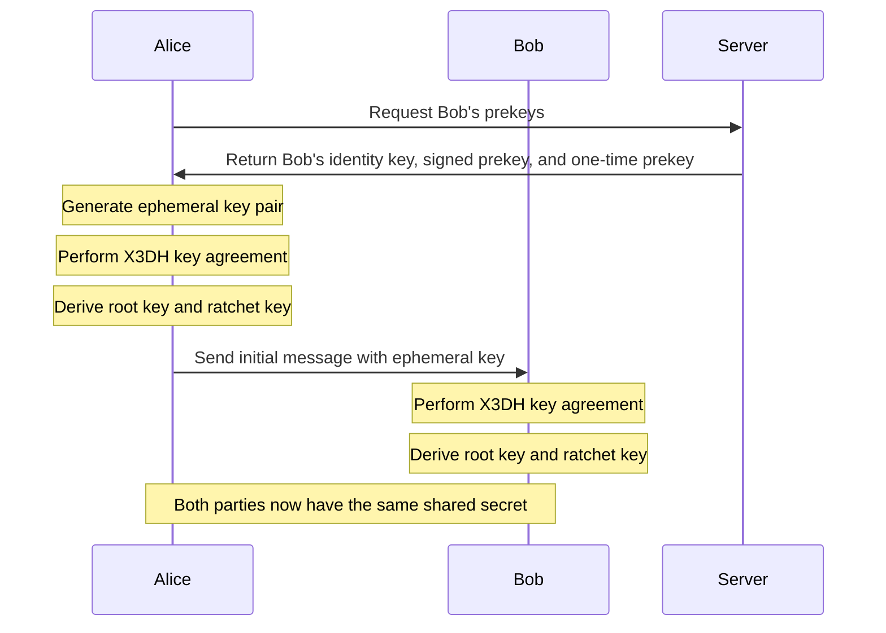
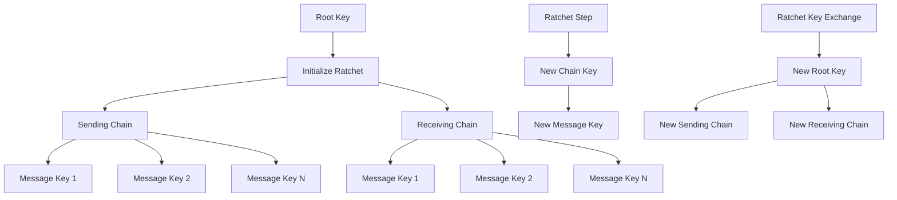
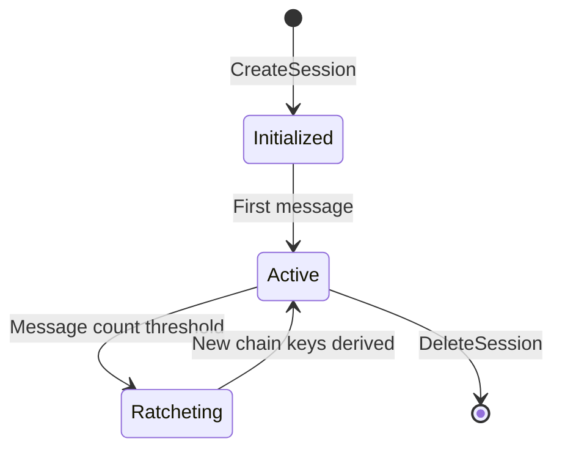

# SignalSharp 🔐

SignalSharp is a minimal viable implementation of the Signal protocol in C#. It provides end-to-end encryption capabilities while adhering to SOLID principles and maintaining high test coverage.

## ✨ Features

- 🔒 End-to-end encryption using modern cryptographic primitives
- 🤝 X3DH key agreement protocol with identity, signed prekey, and one-time prekey support
- 🔄 Double Ratchet algorithm for forward secrecy and message encryption
- 💾 Secure key storage and management
- 📦 .NET Standard 2.1 compliant
- 🔌 Flexible JSON serialization with pluggable providers
- ✅ Comprehensive test coverage with 100+ unit tests
- 🔐 Message authentication with MAC verification
- 🔑 Automatic key rotation and ratcheting
- 🛡️ Protection against message skipping attacks

## 🏗️ Project Structure

- **SignalSharp.Core**: Core protocol logic and interfaces
- **SignalSharp.Security**: Cryptographic operations and key management
  - X3DH key agreement implementation
  - Double Ratchet implementation
  - Hash and encryption services
- **SignalSharp.Storage**: Persistent storage of keys and sessions
- **SignalSharp.Serialization.SystemTextJson**: System.Text.Json implementation
- **SignalSharp.Serialization.NewtonsoftJson**: Newtonsoft.Json implementation
- **SignalSharp.Tests**: Unit, integration, and security tests

## 📋 Requirements

- .NET Standard 2.1
- System.Security.Cryptography
- xUnit (for testing)

## 🚀 Getting Started

1. Clone the repository
2. Build the solution
3. Run the tests
4. Start using the library in your project

## 💻 Usage Examples

### Basic Usage

```csharp
// Initialize dependencies
var keyStore = new FileKeyStore("./keys");
var encryptionService = new AesEncryptionService();
var hashService = new HashService();
var keyExchangeService = new EcKeyExchangeService();
var doubleRatchetService = new DoubleRatchetService(
    encryptionService,
    keyExchangeService,
    hashService);

// Create a session manager
var sessionManager = new SessionManager(
    keyStore,
    encryptionService,
    keyExchangeService,
    hashService,
    doubleRatchetService);

// Create a new session
var sessionId = await sessionManager.CreateSessionAsync(
    remoteIdentityKey,
    remotePreKey,
    remotePreKeySignature);

// Encrypt a message
var encryptedMessage = await sessionManager.EncryptMessageAsync(
    sessionId,
    Encoding.UTF8.GetBytes("Hello, Signal!"));

// Decrypt a message
var decryptedMessage = await sessionManager.ProcessIncomingMessageAsync(
    sessionId,
    encryptedMessage);

// Clean up
await sessionManager.DeleteSessionAsync(sessionId);
```

### Advanced Usage

#### Custom JSON Serialization

```csharp
// Using System.Text.Json
var jsonOptions = new JsonSerializerOptions
{
    PropertyNameCaseInsensitive = true,
    PropertyNamingPolicy = JsonNamingPolicy.CamelCase
};
var jsonSerializer = new SystemTextJsonSerializer(jsonOptions);

// Using Newtonsoft.Json
var jsonSettings = new JsonSerializerSettings
{
    NullValueHandling = NullValueHandling.Ignore,
    ContractResolver = new CamelCasePropertyNamesContractResolver()
};
var jsonSerializer = new NewtonsoftJsonSerializer(jsonSettings);
```

#### Custom Key Storage

```csharp
// Implement your own key storage
public class CustomKeyStore : IKeyStore
{
    public async Task StoreKeyAsync(string keyId, byte[] key)
    {
        // Your implementation
    }

    public async Task<byte[]> GetKeyAsync(string keyId)
    {
        // Your implementation
        return null;
    }

    // Implement other interface methods
}
```

## 🔒 Security Considerations

- All cryptographic operations use secure random number generation
- Keys are securely stored and managed
- Input validation and guard clauses prevent common vulnerabilities
- Memory safety is ensured through proper key handling
- JSON serialization is abstracted to allow secure implementations
- X3DH protocol implementation follows Signal Protocol specifications
- Double Ratchet implementation ensures forward secrecy
- Message authentication using HMAC-based MAC
- Protection against message skipping attacks
- Comprehensive null checks and parameter validation
- Immutable key pairs and session states
- Secure key derivation using HMAC-based key derivation
- Automatic key rotation and ratcheting

## 🧪 Testing

The project maintains high test coverage with:
- Unit tests for all core components
- Integration tests for key agreement and session management
- Security tests for cryptographic operations
- Mock-based testing for external dependencies
- Comprehensive edge case and error handling tests
- Double Ratchet algorithm tests
- Message encryption/decryption tests
- MAC verification tests

## 🔧 Troubleshooting Guide

### Common Issues

1. **Key Storage Errors**
   - Ensure the key storage directory exists and has proper permissions
   - Check if keys are being properly encrypted before storage
   - Verify key cleanup is working correctly

2. **Message Encryption/Decryption Failures**
   - Verify session state is properly maintained
   - Check if ratchet keys are being properly rotated
   - Ensure MAC verification is passing

3. **Key Exchange Issues**
   - Verify identity keys are properly generated and stored
   - Check pre-key signatures
   - Ensure proper key derivation in X3DH protocol

### Best Practices

1. **Key Management**
   - Regularly rotate identity keys
   - Clean up unused session states
   - Implement proper key backup strategies

2. **Error Handling**
   - Always check for null parameters
   - Implement proper exception handling
   - Log security-related events

3. **Performance**
   - Use async/await for all operations
   - Implement proper cleanup
   - Monitor memory usage

## 📊 Architecture

### Component Diagram



### Data Flow



### X3DH Key Agreement Protocol



### Double Ratchet Algorithm



### Session State Management



## 🤝 Contributing

1. Fork the repository
2. Create a feature branch
3. Commit your changes
4. Push to the branch
5. Create a pull request

## 📄 License

This project is licensed under the MIT License - see the LICENSE file for details.

## 🙏 Acknowledgments

- Signal Protocol specification
- .NET Cryptography libraries
- Contributors and maintainers 